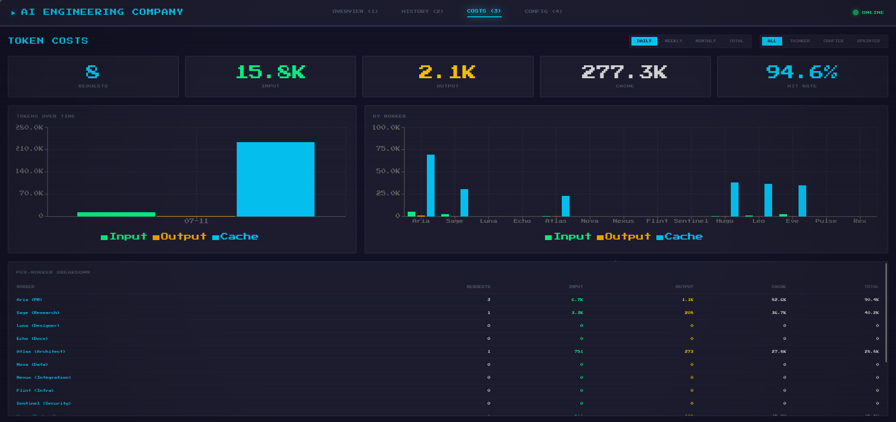
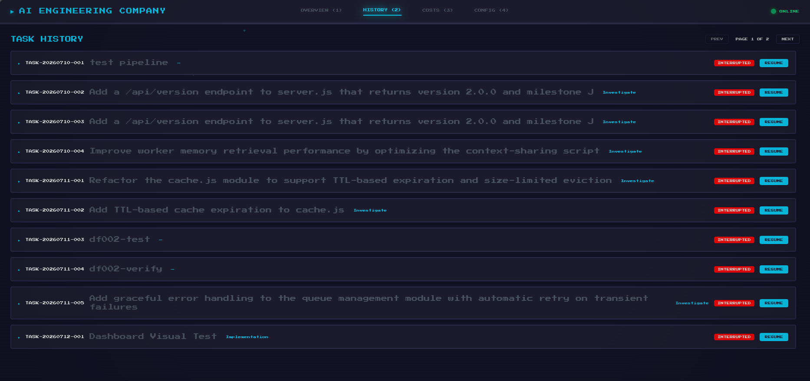

# AI Engineering Company (AIC)

> Turn natural language into working code — with an entire AI engineering team at your command.

AIC is a multi-agent orchestration system built on [Hermes Agent](https://hermes-agent.nousresearch.com). Instead of prompting a single model, you get a structured engineering company: a Dispatcher routes your request, a PM investigates requirements, an Architect designs the solution, Engineers build it in parallel, QA verifies, and a Governor reviews before anything touches your repo. Every task follows a strict 5-phase pipeline. No shortcuts, no skipped steps.

---

## Key Features

- **Engineering Organization** — Specialized roles across Leadership, Product, Engineering, and Platform tiers
- **Dispatcher Intelligence** — Natural language task classification, routing, and worker delegation
- **5-Phase Pipeline** — Investigate → Planning → Implementation → Verification → Closeout
- **Parallel Workers** — Frontend, Backend, and Infrastructure engineers execute simultaneously
- **Knowledge Platform** — Persistent knowledge base with search, task-triggered ingestion, and cross-project learning
- **Multi-Project Management** — Switch target projects without restarting; isolated per-project tracking
- **Pixel Office Dashboard** — Real-time operations control center with virtual office, pipeline tracking, and metrics
- **Observability** — Live worker status, pipeline progress, runtime gate, memory, CPU, and request throughput
- **Cost Tracking** — Per-worker token breakdown (input/output/cache) with time-filtered charts
- **Task History** — Paginated task records with expandable context and resume support
- **Configuration** — Runtime config viewer with environment, model tier, and project settings

---

## Dashboard

The Operations Control Center runs at `http://localhost:6868`.


| Page | Purpose |
|------|---------|
| **Overview** | Operations Control Center — virtual office floor, live pipeline, runtime gate, performance metrics, and worker status cards |
| **History** | Task archive — paginated list with status badges, expandable context, and resume for interrupted tasks |
| **Costs** | Token economics — per-worker input/output/cache breakdown, time-filtered bar charts, and cache hit rates |
| **Configuration** | System settings — environment variables, model tier assignments, and opencode configuration |






---

## The Team

Every worker runs via [OpenCode CLI](https://github.com/opencode-ai/opencode) and uses one of three model tiers: **Thinker** (complex reasoning), **Crafter** (implementation), or **Sprinter** (fast tasks).

### Leadership

| Worker | Role | Tier | Personality | Phase |
|--------|------|------|-------------|-------|
| **Hermes** | Dispatcher | System | Strict butler — routes tasks, never writes code, talks to user then delegates | Global |
| **Rex** | Governor | Sprinter | Compliance gate — final reviewer, never auto-commits, evaluates and awaits user approval | Closeout |

### Product

| Worker | Role | Tier | Personality | Phase |
|--------|------|------|-------------|-------|
| **Aria** | Product Manager | Thinker | Empathetic translator — turns vague requests into user stories, data models, and acceptance criteria | Investigate |
| **Sage** | Researcher | Thinker | Evidence-driven analyst — finds facts, validates assumptions, reads docs, no guessing | Investigate |
| **Luna** | Designer | Crafter | User advocate — specifies layouts, interactions, visual consistency, thinks in user journeys | Implementation |
| **Echo** | Documentation Engineer | Sprinter | Thorough writer — produces structured docs, reports, and changelogs | Closeout |

### Engineering

| Worker | Role | Tier | Personality | Phase |
|--------|------|------|-------------|-------|
| **Atlas** | Architect | Thinker | Systems thinker — designs databases, APIs, tech stack, thinks in trade-offs and constraints | Planning |
| **Hugo** | Backend Engineer | Crafter | Reliability nerd — Node.js, Python, APIs, database logic, security and performance first | Implementation |
| **Leo** | Frontend Engineer | Crafter | UI craftsman — React, Vite, Tailwind, builds what Luna designs and Atlas architected | Implementation |
| **Eve** | QA Engineer | Sprinter | Perfectionist tester — tests everything, writes tests, breaks things so users don't have to | Verification |
| **Pulse** | Performance Engineer | Sprinter | Bottleneck hunter — profiling, load testing, optimization, makes things fast | Verification |

### Platform

| Worker | Role | Tier | Personality | Phase |
|--------|------|------|-------------|-------|
| **Nova** | Data Engineer | Crafter | Data specialist — schemas, migrations, ETL pipelines, data integrity | Planning |
| **Nexus** | Integration Engineer | Crafter | Connector — API integrations, service mesh, protocol handling | Planning |
| **Flint** | Infrastructure Engineer | Crafter | Automation obsessed — Docker, CI/CD, deployment scripts, "if it runs twice, automate it" | Planning |
| **Sentinel** | Security Engineer | Crafter | Threat modeler — vulnerability scanning, auth hardening, security review | Planning |

---

## Architecture

```
User (natural language)
    ↓
Dispatcher (Hermes) — classification, routing, orchestration
    ↓
Pipeline (5 phases) — lifecycle enforcement, phase barriers
    ↓
Engineering Teams — specialized roles, Thinker/Crafter/Sprinter tiers
    ↓
Knowledge Base — persistent context, search, ingestion
    ↓
Dashboard — real-time monitoring, metrics, configuration
```

Detailed architecture: [Architecture Overview](./docs/architecture/architecture-overview.md)

---

## Quick Start

```bash
# 1. Install
git clone --depth 1 https://github.com/Deriest/aic-skill.git ~/.hermes/skills/workflows/aic

# 2. Setup (interactive — configures provider, models, environment)
bash ~/.hermes/skills/workflows/aic/scripts/setup.sh

# 3. Build dashboard
cd ~/.hermes/skills/workflows/aic/dashboard && npm install && npm run build

# 4. Start (in any Hermes chat)
/aic
/aic project ~/my-app
```

Dashboard opens at `http://localhost:6868`.

### Commands

**Dispatcher** (chat with Hermes):

| Command | Description |
|---------|-------------|
| `/aic` | Activate Dispatcher, run preflight, start server |
| `/aic project <path>` | Set or switch target project |
| `/aic status` | Show current pipeline status |
| `/aic status task <TASK-ID>` | Show task details |
| `/aic continue` | Resume last interrupted task |
| `/aic stop` | Deactivate Dispatcher |

**CLI** (terminal):

| Command | Description |
|---------|-------------|
| `./aic setup` | First-time interactive setup |
| `./aic update` | Update AIC to latest version |
| `./aic test` | Run self-test |
| `./aic uninstall` | Remove AIC completely |

---

## Repository Structure

```
├── archive/            # Archived milestone reports and defect logs
├── dashboard/          # Operations Control Center (React + Vite + Tailwind)
├── docs/               # Documentation (API, architecture, guides, operations)
├── knowledge/          # Knowledge base scripts and data
├── references/         # Reference documents (46 files)
├── scripts/            # Runtime scripts (server, pipeline, workers, setup)
├── templates/          # Document templates (16 files)
├── aic                 # CLI entry point
├── SKILL.md            # Hermes skill definition
└── README.md
```

---

## Documentation

Entry point: [docs/INDEX.md](./docs/INDEX.md)

| Guide | Description |
|-------|-------------|
| [API Reference](./docs/api/api-reference.md) | All 21 endpoints, authentication, response formats |
| [Architecture Overview](./docs/architecture/architecture-overview.md) | System design, components, data flow |
| [Developer Guide](./docs/guides/developer-guide.md) | Setup, repository layout, coding conventions |
| [Operations Guide](./docs/operations/operations-guide.md) | Deployment, monitoring, recovery |
| [Operator Guide](./docs/guides/operator-guide.md) | Task management, dashboard usage |
| [Operations Runbook](./references/operations-runbook.md) | Troubleshooting, escalation procedures |

---

## Roadmap

- Workspace Dashboard
- Live Dashboard Events
- WebSocket Real-Time Updates
- Enhanced Observability
- Plugin Ecosystem

---

## License

MIT — See [LICENSE](./LICENSE)

---

<p align="center">
  <i>Built with <a href="https://hermes-agent.nousresearch.com">Hermes Agent</a> by Nous Research</i><br/>
  <i>Originally ported from OpenClaw plugin by TVD</i>
</p>
