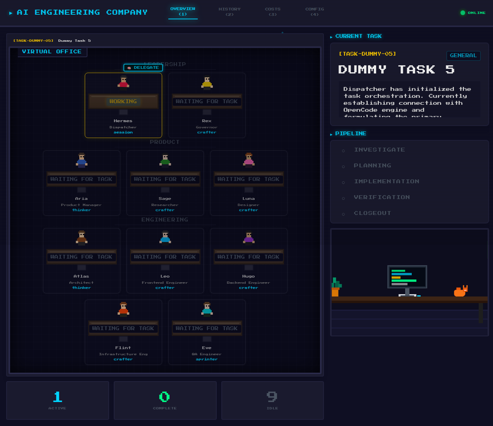
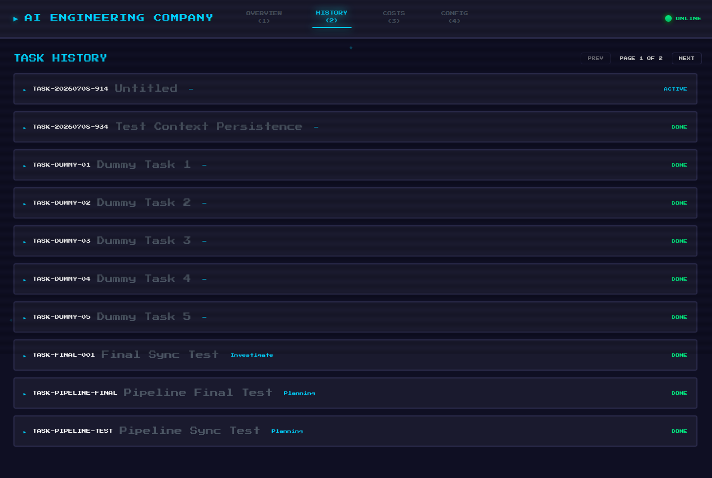
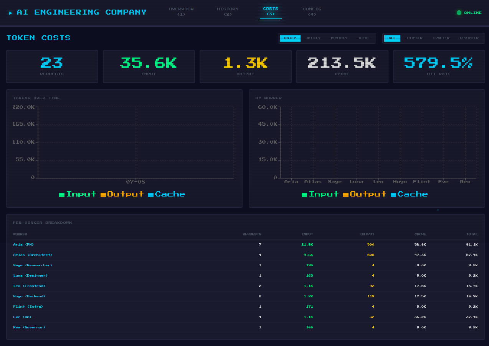

# AI Engineering Company (AIC)

AIC is a multi-agent orchestration framework ported from OpenClaw, allowing you to run a 10-person AI software development firm locally via the Hermes Desktop app.

## The Team

| # | Role | Name | Tier | Focus |
|---|------|------|------|-------|
| 1 | **Dispatcher** (You) | Hermes | Orchestrator | User communication, task classification, pipeline routing. |
| 2 | **PM** | Aria | Thinker | Natural language translation, user stories, structured specs. |
| 3 | **Researcher** | Sage | Crafter | Evidence, API docs validation, competitor analysis. |
| 4 | **Designer** | Luna | Crafter | UX/UI specs, layouts, visual consistency. |
| 5 | **Architect** | Atlas | Thinker | System design, database schemas, tech stack tradeoffs. |
| 6 | **Frontend** | Leo | Crafter | React, Vite, Tailwind, UI implementation. |
| 7 | **Backend** | Hugo | Crafter | Node, Python, APIs, database logic. |
| 8 | **Infra** | Flint | Crafter | Deployment, CI/CD, Docker, scripts. |
| 9 | **QA** | Eve | Sprinter | Testing, validation, defect reporting. |
| 10| **Governor** | Rex | Crafter | Safety, policy compliance, final approval. |

## The Pipeline

Every task strictly follows a 5-phase sequential lifecycle:
`Investigate` → `Planning` → `Implementation` → `Verification` → `Closeout`

## Features

- **Context Persistence:** Tasks are saved to `.aic/tasks/TASK-XXX/` with full phase context and state.
- **WP Decomposition:** PM can break down large projects into dependency-tracked Work Packages.
- **Resume Flow:** Interruptions or server crashes are safely preserved. Type `aic continue` to resume.
- **Token Tracking:** Detailed cost tracking (cache hits, input/output) mapped per worker.

## The Dashboard

The Control Plane Dashboard runs locally on port `6868`.

### Overview
Live pipeline tracking and worker grid visualization.

### History
Persistent task tracking, interrupted run recovery, and Work Package dependency trees.

### Costs
Per-worker token usage, cache hit rate tracking, and time-filtered metrics.

## Known Limitations & Mitigation

| Issue | Workaround |
|-------|------------|
| **Worker Context Bleed** (Worker tries to do another worker's job) | The Dispatcher (`spawn-worker.sh`) injects strict Role bounding (SOUL prompts) per worker. Do not manually spawn workers using `delegate_task`; always use `spawn-worker.sh` so role boundaries are enforced. |
| **Pipeline bypass** (Skipping PM/Architect for "simple" bugs) | The API rejects Out-of-Order execution. A bugfix must still pass through PM (for regression notes) and QA (for validation). Enforced by `/api/agent-status` lifecycle guard. |
| **Missing Context.json on Resume** | Older tasks (pre-persistence feature) won't have context. Run new tasks via `/api/task-start`. |
| **Dashboard Blank Screen in Prod** | Rollup circular dependency with Recharts. Fixed via Vite vendor chunking in `vite.config.ts`. Do not import heavy UI libraries dynamically. |
