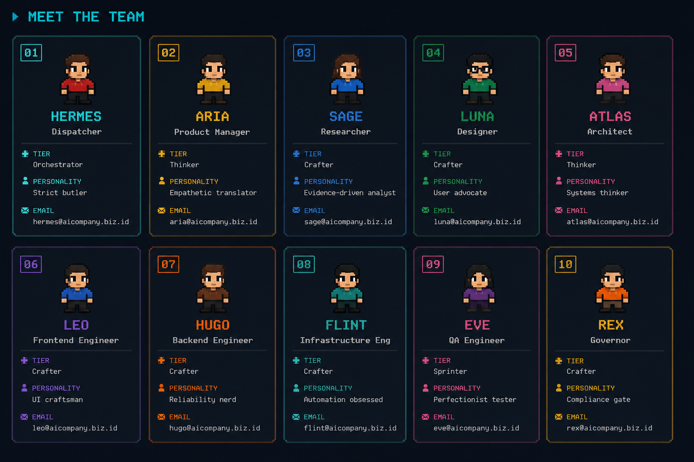

# AI Engineering Company (AIC)

> **A 10-agent AI software development workforce, orchestrated from your terminal.**

AIC transforms Hermes into a full engineering company — with a Dispatcher, PM, Architect, Engineers, QA, and Governor — all working through a strict 5-phase pipeline. You talk naturally; AIC builds.


---

## Workspace Context

AIC cleanly separates its own engine from your target codebase.
- **Skill Repository (Engine):** `~/.hermes/skills/workflows/aic/` (Where the API server and dashboard live).
- **Target Project (Your Code):** Can be anywhere on your machine.
- **Switching Projects:** Use `./aic project <path>` to tell the AIC engine which folder the workers should operate on. The dashboard and task tracking will pivot to monitor that specific active project.

---

## Meet the Team



| # | Name | Role | Tier | Engine | Personality | What they actually do |
|---|------|------|------|--------|-------------|----------------------|
| 1 | **Hermes** | Dispatcher | Orchestrator | `delegate_task` | Strict butler | Routes your request. Never writes code. Talks to you, then delegates. |
| 2 | **Aria** | Product Manager | Thinker | `opencode run` | Empathetic translator | Turns "I want a feature" into user stories, data models, and acceptance criteria. |
| 3 | **Sage** | Researcher | Crafter | `opencode run` | Evidence-driven analyst | Finds facts, validates assumptions, reads docs. No guessing. |
| 4 | **Luna** | Designer | Crafter | `opencode run` | User advocate | Specifies layouts, interactions, visual consistency. Thinks in user journeys. |
| 5 | **Atlas** | Architect | Thinker | `opencode run` | Systems thinker | Designs databases, APIs, tech stack. Thinks in trade-offs and constraints. |
| 6 | **Leo** | Frontend Engineer | Crafter | `opencode run` | UI craftsman | React, Vite, Tailwind. Builds what Luna designs, what Atlas architected. |
| 7 | **Hugo** | Backend Engineer | Crafter | `opencode run` | Reliability nerd | Node.js, Python, APIs, database logic. Security and performance first. |
| 8 | **Flint** | Infrastructure Eng | Crafter | `opencode run` | Automation obsessed | Docker, CI/CD, deployment scripts. "If it runs twice, automate it." |
| 9 | **Eve** | QA Engineer | Sprinter | `opencode run` | Perfectionist tester | Tests everything. Writes tests. Breaks things so users don't have to. |
| 10 | **Rex** | Governor | Crafter | `opencode run` | Compliance gate | Final reviewer. **STRICT RULE:** Never auto-commits code. Evaluates output and awaits Operator's explicit approval before any git commits are made. |

---

## The Pipeline

Every task — no matter how small — follows this 5-phase lifecycle:

```
┌─────────────┐    ┌─────────────┐    ┌─────────────────────────┐    ┌──────────────┐    ┌───────────┐
│ INVESTIGATE │ →  │  PLANNING   │ →  │      IMPLEMENTATION     │ →  │ VERIFICATION │ →  │  CLOSEOUT │
│ (Aria, Sage)│    │(Atlas, Luna)│    │   (Leo, Hugo, Flint)    │    │    (Eve)     │    │   (Rex)   │
└─────────────┘    └─────────────┘    └─────────────────────────┘    └──────────────┘    └───────────┘
```

- **Investigate**: PM translates your request into structured specs, backed by Researcher's evidence.
- **Planning**: Architect designs the technical approach, Designer prepares UI specs.
- **Implementation**: Engineers build it (Frontend, Backend, and Infra can run in parallel).
- **Verification**: QA tests against the original requirements and checks coverage.
- **Closeout**: Governor reviews for compliance and quality.

**No phase is skippable.** Even "just fix a typo" goes through the pipeline.

---

## Features

| Feature | Description |
|---------|-------------|
| **Context Persistence** | Every task saves to `.aic/tasks/TASK-XXX/` — context, reports, state. Nothing is lost. |
| **Resume (`/aic continue`)** | Interrupted tasks (crash, token limit, sleep) can be resumed from where they stopped. |
| **WP Decomposition** | Large projects are broken into dependency-tracked Work Packages by PM. |
| **Token Cost Tracking** | Per-worker token usage, cache hit rates, time-filtered metrics. |
| **Auto Pipeline Sync** | Worker status and pipeline phase sync automatically — no manual updates needed. |
| **Task History** | Paginated task list with expandable details, status badges, and WP trees. |

---

## Dashboard

The control panel runs on `http://localhost:6868`.

### Overview

Live pipeline status, worker grid with real-time status indicators, and current task details.

### Task History

Persistent task records with pagination (10/page), expandable context details, and red INTERRUPTED badges for resumable tasks.

### Token Costs

Per-worker breakdown of input/output/cache tokens, time-filtered bar charts, and cache hit rate.

---

## How to Install

### Prerequisites

| Dependency | Required | Check |
|------------|----------|-------|
| **Hermes Agent** | ✅ Yes | `hermes --version` |
| **Node.js + npm** | ✅ Yes | `node --version` |
| **jq** | ✅ Yes | `jq --version` |
| **OpenCode CLI** | ✅ Yes (for engineers) | `opencode --version` |
| **Python 3** | ⚠️ Optional (for scripts) | `python3 --version` |

### Quick Install

```bash
# 1. Clone the AIC skill
git clone --depth 1 https://github.com/Deriest/aic-skill.git ~/.hermes/skills/workflows/aic

# 2. Run setup (interactive — picks provider, models, configures everything)
bash ~/.hermes/skills/workflows/aic/scripts/setup.sh

# 3. Build the dashboard
cd ~/.hermes/skills/workflows/aic/dashboard && npm install && npm run build

# 4. Start the server
# You don't need to start it manually! Just type `/aic` in Hermes chat.
# It will run a preflight check and auto-start the server for you.
```

### What setup.sh does (6 Steps)

1. **System Check**: Verifies OS and dependencies (Hermes, Node, npm, jq, OpenCode).
2. **Provider Setup**: Detects and configures your active AI Provider (e.g., OpenAI, Anthropic, Local).
3. **Model Fetching**: Dynamically pulls available models from the provider's API.
4. **Tier Configuration**: Lets you assign specific models for **Thinker**, **Crafter**, and **Sprinter** roles.
5. **Config Generation**: Generates `opencode.jsonc` and `.env` with auto context handling.
6. **Workspace Initialization**: Prepares the global namespace and configures the API server bindings.

---

## How to Use

### Starting AIC

Activate the Dispatcher mode. This triggers a Preflight check (starting the server) and prompts you to select your target project folder.

```
You:  /aic

Hermes: [Preflight Check Running... Server Started]
        Hello, I am the AIC Dispatcher.
        Please set your target project folder:
        ./aic project <path/to/folder>

You:  ./aic project ~/Documents/my-app

Hermes: Target project set successfully. The pipeline is currently idle.
        What task can I help you with today?
```

### Handling Large Tasks (Work Packages)

How does AIC know if a task is large? It's a two-step collaboration:
1. **The Dispatcher (Hermes)** detects the scale based on your initial prompt. If it's a massive request (e.g., "build a full-stack HR system"), Hermes flags it as an "Epic" and instructs the PM to decompose it.
2. **The Product Manager (Aria)** then analyzes the system requirements and logically breaks it down into bite-sized **Work Packages (WPs)**.

Instead of rushing a massive feature into one prompt, the pipeline processes it sequentially:

```
You:  build a full-stack HR management system

Hermes: Task classified: DEVELOP (Large Project)
        Spawning PM (Aria) for decomposition...
        
        [Aria breaks the project into 4 WPs]
        WP-1: Database Schema & Authentication
        WP-2: Employee Directory API
        WP-3: Frontend Dashboard UI
        WP-4: Role-Based Access Control
        
        [Hermes runs the full 5-phase pipeline for WP-1]
        [Once WP-1 is Closeout, Hermes starts the pipeline for WP-2]
```
You can view the dependency tree and progress of these WPs in the **History Tab** of the Dashboard.

### Giving a task (natural language)

```
You:  build an e-commerce website

Hermes: Task classified: DEVELOP (Full Pipeline)
        Spawning PM (Aria) for investigation...
        
        [Aria runs: generates requirements.json]
        [Atlas runs: generates design.json]
        [Leo + Hugo run: implement frontend + backend]
        [Eve runs: tests everything]
        [Rex runs: final review]
        
        Task complete. 5 files changed, 3 new features.
        Do you want to commit these changes?
```

### Checking status

```
You:  /aic status

Hermes: ┌─ TASK-20260708-200 ──────────────┐
        │ Status: ACTIVE                    │
        │ Phase: Implementation             │
        │ Workers: Leo (working), Hugo (idle)│
        └───────────────────────────────────┘
```

### Resuming an interrupted task

```
You:  /aic continue

Hermes: === Resuming TASK-20260708-200 ===
        Title: E-Commerce Website
        Phase: Implementation
        Last report: frontend-output.md (45 lines)
        
        Resume this task? [y/N]
```

### Getting task details

```
You:  /aic status task TASK-20260708-200

Hermes: ┌─ TASK DETAIL ─────────────────────┐
        │ Type: develop                     │
        │ Created: 2026-07-08 14:30         │
        │ Reports:                          │
        │   • pm-report.md (120 lines)      │
        │   • architect-plan.md (85 lines)  │
        │   • frontend-output.md (45 lines) │
        │   • backend-output.md (67 lines)  │
        │ Work Packages: 2/4 complete       │
        └───────────────────────────────────┘
```

### Available commands

| Command | What it does |
|---------|-------------|
| `/aic` | Activate Dispatcher mode and run **Preflight Check** (auto-checks dependencies, builds dashboard, and starts the API server) |
| `./aic project <path>` | Change project: Point the AIC workspace to a new or existing project folder |
| `/aic status` | Show current pipeline status |
| `/aic status task <TASK-ID>` | Show detailed task info |
| `/aic continue` | Resume last interrupted task |
| `/aic stop` | Deactivate Dispatcher mode |

---

## Configuration

### .env (auto-generated by setup.sh)

```env
PROVIDER=your-provider
MODEL_THINKER=provider/model-name
MODEL_CRAFTER=provider/model-name
MODEL_SPRINTER=provider/model-name
```

### Model tiers

| Tier | Use for | Context window | Workers |
|------|---------|----------------|---------|
| **Thinker** | Complex reasoning, architecture | 80% of max | Aria (PM), Atlas (Architect) |
| **Crafter** | Coding, implementation | 60% of max | Leo, Hugo, Flint, Sage, Luna, Rex |
| **Sprinter** | Fast tasks, testing | 40% of max | Eve (QA) |

---

## Scripts Reference

| Script | Purpose | Usage |
|--------|---------|-------|
| `setup.sh` | First-time setup | `bash scripts/setup.sh` |
| `preflight.sh` | Pre-flight check + server start | `bash scripts/preflight.sh --auto-start` |
| `spawn-worker.sh` | Spawn a worker with auto-status | `bash scripts/spawn-worker.sh <worker> <tier> <dir> <prompt>` |
| `server.js` | Dashboard API server | `node scripts/server.js 6868` |
| `aic` | CLI tool | `./aic continue` |
| `context-gather.sh` | Gather project context | `bash scripts/context-gather.sh <dir> --tier crafter` |

---

## Known Limitations & Workarounds

### A. General System Issues

| Issue | Why it happens | Workaround |
|-------|---------------|------------|
| **Pipeline is sequential** | PM → Architect → Engineers → QA → Governor, always | For parallel work, spawn Frontend + Backend simultaneously (allowed in Implementation phase) |
| **No undo for code changes** | Workers use `opencode run` which modifies files directly | Use git branching before large tasks; `git diff` after each phase |
| **Setup requires internet** | `npm install`, model fetching, OpenCode CLI install | Pre-download dependencies; use `--offline` flags where possible |
| **Single server instance** | Only one AIC server per machine (port 6868) | Change port in `server.js` if needed |
| **No Multi-Repo Support** | The engine orchestrates tasks against a single active project directory at a time. | On future planning |
| **No Multi-Session Support** | The pipeline, agents, and state tracker operate on one global active session. | On future planning |

### B. Chat / Dispatcher Issues

| Issue | Why it happens | Workaround |
|-------|---------------|------------|
| **Dispatcher takes over worker tasks** | AI model sees code and "wants to help" | Strict SOUL prompts enforce role boundaries; `spawn-worker.sh` injects role context automatically |
| **Dispatcher skips phases** | "This is trivial, just fix it" | API lifecycle guard rejects out-of-order phase execution; 403 error forces correct flow |
| **Worker doesn't finish before next starts** | Race condition in parallel spawning | `spawn-worker.sh` is blocking — it waits for `opencode run` to exit before returning |
| **Governor auto-commits code** | Model ignores "ask user first" rule | Rule 9 in SKILL.md: Governor MUST NOT commit. Dispatcher asks user. Enforced by SOUL prompt. |
| **Language mismatch** | User speaks Indonesian, worker responds in English | Dispatcher auto-detects language and passes it to worker prompts |

### C. Dashboard / API Issues

| Issue | Why it happens | Workaround |
|-------|---------------|------------|
| **Dispatcher tokens not tracked** | Dispatcher runs natively in Hermes core, not via `opencode run` so metrics aren't captured | Intentional. Dispatcher cost is tracked via your Hermes bill, not the AIC dashboard |
| **History page empty after feature deploy** | Tasks created before persistence feature | Run new tasks via `/api/task-start`; old tasks won't have context files |
| **Dashboard doesn't auto-refresh** | SPA polls on interval, not WebSocket | Refresh manually or wait for next poll cycle (configurable) |
| **Metrics not updating** | Server restarted, in-memory state lost | Metrics persist to `.aic/metrics.json`; reload on server start |

---

## For Contributors

### Adding a new worker

1. Add to `dashboard/src/data/workers.ts` with colors and section
2. Add to `WORKERS` array in `scripts/server.js`
3. Add phase mapping in `scripts/spawn-worker.sh` (`PHASE_MAP_<name>`)
4. Update `SKILL.md` worker table and SOUL prompt

### Adding a new pipeline phase

1. Update `phases` array in `PipelineTracker.tsx`
2. Update `PHASE_ALLOWED` map in `server.js`
3. Update `PHASE_MAP` in `spawn-worker.sh`
4. Update `SKILL.md` pipeline documentation

---

## License

MIT — See [LICENSE](./LICENSE)

---

<p align="center">
  <i>Built with Hermes Agent by Nous Research</i><br/>
  <i>AIC originally ported from OpenClaw plugin by TVD</i>
</p>
